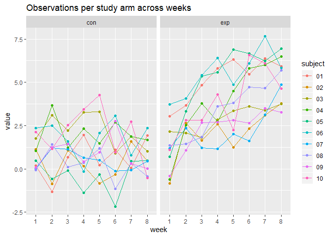

p8105\_hw5\_fw2334
================
Frances Williams
11/6/2019

# Problem 1

``` r
library(tidyverse)
```

    ## -- Attaching packages -------------------------------------------------------------------------------------------- tidyverse 1.2.1 --

    ## v ggplot2 3.2.1     v purrr   0.3.2
    ## v tibble  2.1.3     v dplyr   0.8.3
    ## v tidyr   1.0.0     v stringr 1.4.0
    ## v readr   1.3.1     v forcats 0.4.0

    ## -- Conflicts ----------------------------------------------------------------------------------------------- tidyverse_conflicts() --
    ## x dplyr::filter() masks stats::filter()
    ## x dplyr::lag()    masks stats::lag()

``` r
set.seed(10)

iris_with_missing = iris %>% 
  map_df(~replace(.x, sample(1:150, 20), NA)) %>%
  mutate(Species = as.character(Species))

iris_num_vec = function(x) {
  if (is.numeric(x)) {
    replace_na(x, mean(x, na.rm = TRUE))
  }
  else if (is.character(x)) {
    replace_na(x, "virginica")
  }
}


iris_df = map_df(iris_with_missing, iris_num_vec)
```

# Problem 2

``` r
patient_files = list.files(path = "./files", full.names = TRUE)

experiment_df = patient_files %>% 
  map_df(read.csv) %>% 
  mutate(patient_id = tools::file_path_sans_ext(basename(patient_files))) %>% 
  separate(patient_id, into = c("arm", "id"), sep = "_") %>%
  mutate(subject = as.factor(id)) %>% 
  pivot_longer(week_1:week_8,
    names_to = "week",
    names_prefix = "week_",
    values_to = "value")

exp_plot = experiment_df %>% 
  ggplot(aes(x = week, y = value, color = subject, group = subject)) +
  geom_line() + 
  geom_point() +
  facet_wrap(~arm) +
  labs(
    title = "Observations per study arm across weeks"
  )

exp_plot
```

<!-- -->

For subjects in the experimental arm, values increased over the 8 week
period. This was not the case in the control arm, where observation
values remained more or less the same over the study period.

# Problem 3

#### Simulation with beta1 = 0

``` r
set.seed(10)

sim_regression = function(n = 30, beta0 = 2, beta1) {
  
  sim_data = tibble(
    x = rnorm(n, mean = 0, sd = 1),
    y = beta0 + beta1 * x + rnorm(n, mean = 0, sd = sqrt(50))
  )
  
  ls_fit = lm(y ~ x, data = sim_data) %>% broom::tidy()
  
  tibble(
    beta1_hat = ls_fit[[2,2]],
    p_value = ls_fit[[2,5]]
  )
}

output = vector("list", 10000)

for (i in 1:10000) {
  output[[i]] = sim_regression(beta1 = 0)
}

sim_results0 = bind_rows(output)
```

#### Simulation with list for beta1 ranging from 1 to 6

``` r
b1_list = list("b1_1" = 1, 
               "b1_2" = 2, 
               "b1_3" = 3,
               "b1_4" = 4,
               "b1_5" = 5,
               "b1_6" = 6)

sim_results = 
  tibble(b1 = c(1, 2, 3, 4, 5, 6)) %>% 
  mutate(
    output_lists = map(.x = b1_list, ~rerun(10000, sim_regression(beta1 = .x))),
    estimate_dfs = map(output_lists, bind_rows)) %>% 
  select(-output_lists) %>% 
  unnest(estimate_dfs)
```

``` r
rejected = sim_results %>% 
  mutate(null_rejected = ifelse(p_value <= 0.05, "yes", "no")) 

rejected %>% 
  group_by(b1) %>% 
  summarize(proportion_rejected = sum(null_rejected == "yes")/sum(null_rejected == "yes" | null_rejected == "no")) %>% 
  ggplot(aes(x = b1, y = proportion_rejected)) + 
  geom_point() +
  labs(
    x = "True value of β1",
    y = "Proportion of times null was rejected",
    title = "Power of test by true value of β1")
```

<!-- --> As
effect size increases, power increases.

``` r
b1avg_all = rejected %>% 
  group_by(b1) %>% 
  summarize(avg_b1 = mean(beta1_hat))

b1avg_nullrejected = rejected %>% 
  filter(null_rejected == "yes") %>% 
  group_by(b1) %>% 
  summarize(avg_b1 = mean(beta1_hat))

ggplot() +
  geom_point(data = b1avg_all, aes(x = b1, y = avg_b1, color = "All observations")) +
  geom_point(data = b1avg_nullrejected, aes(x = b1, y = avg_b1, color = "Null rejected")) +
  labs(
    x = "True value of β1",
    y = "Average value of estimated b1",
    title = "Mean estimated b1 by true β1"
  )
```

<!-- -->

The sample average of b1 is higher than the true value of β1. A higher
estimated effect size leads to rejecting the null, therefore if we
eliminate values for which the null is not rejected our average effect
size is going to be larger.
